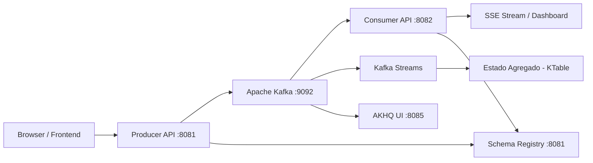
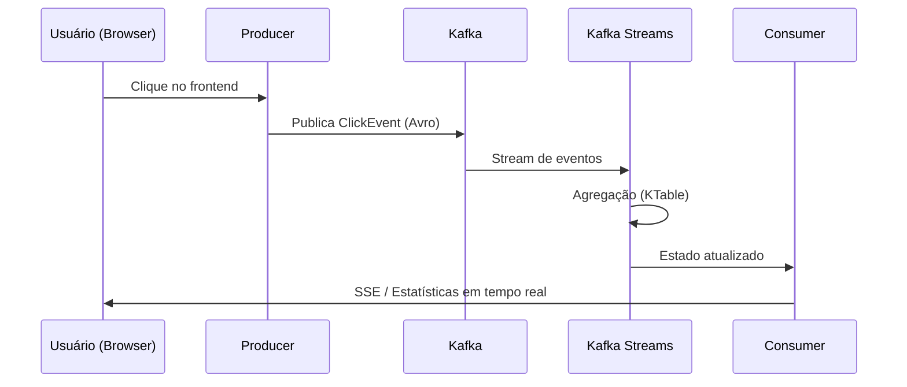
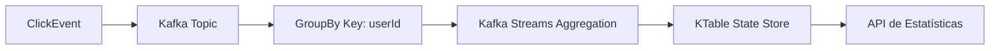

# Click Tracker com Apache Kafka e Avro

Sistema de rastreamento de cliques em tempo real utilizando **Apache Kafka**, **Avro**, **Schema Registry** e **Spring Boot**.

## Visão Geral

O Click Tracker é uma aplicação distribuída para processamento de eventos de clique em tempo real, contemplando:

- Captura de eventos via frontend
- Publicação assíncrona em Kafka
- Serialização com Avro + Schema Registry
- Processamento com Kafka Streams
- Agregações em tempo real com KTable
- Atualização de dashboard via SSE

---

## Arquitetura



---

## Fluxo de Eventos



---

## Fluxo de Agregação



---

## Tecnologias

| Tecnologia      | Finalidade               |
| --------------- | ------------------------ |
| Java 17         | Linguagem                |
| Spring Boot     | Backend principal        |
| Apache Kafka    | Streaming de eventos     |
| Avro            | Serialização de dados    |
| Schema Registry | Governança de schemas    |
| Kafka Streams   | Processamento de eventos |
| Docker Compose  | Infraestrutura           |
| AKHQ            | Interface Kafka          |

---

## Estrutura do Projeto

```
click-tracker/
├── docker-compose.yml
├── avro-schemas/
│   └── ClickEvent.avsc
├── click-producer/
│   ├── controller/
│   ├── service/
│   └── config/
├── click-consumer/
│   ├── controller/
│   ├── service/
│   └── config/
└── README.md
```

---

## Pré-requisitos

* Java 17+
* Maven 3.6+
* Docker Desktop
* 8 GB RAM recomendado

---

## Como Executar

### 1. Subir infraestrutura

```bash
docker-compose up -d
```

### 2. Gerar classes Avro

```bash
cd click-producer && mvn clean generate-sources
cd ../click-consumer && mvn clean generate-sources
```

### 3. Executar Producer

```bash
cd click-producer
mvn spring-boot:run
```

### 4. Executar Consumer

```bash
cd click-consumer
mvn spring-boot:run
```

---

## Endpoints

### Producer (:8081)

| Método | Endpoint      | Descrição                |
| ------ | ------------- | ------------------------ |
| GET    | `/`           | Interface de testes      |
| POST   | `/api/clicks` | Publica evento de clique |

Exemplo:

```json
{
  "userId": "user123",
  "page": "/home",
  "elementId": "button1",
  "sessionId": "session_abc"
}
```

---

### Consumer (:8082)

| Método | Endpoint            | Descrição              |
| ------ | ------------------- | ---------------------- |
| GET    | `/api/stats`        | Estatísticas agregadas |
| GET    | `/api/stats/stream` | Stream SSE             |

Exemplo de resposta:

```json
{
  "totalClicks": 156,
  "userClickCount": {
    "user123": 45
  },
  "pageClickCount": {
    "/home": 89
  },
  "elementClickCount": {
    "button1": 34
  }
}
```

---

## Conceitos Abordados

### Particionamento

* Chave: `userId`
* Garantia de ordenação por usuário
* Processamento consistente por partição

### Avro vs JSON

| Avro              | JSON          |
| ----------------- | ------------- |
| Menor payload     | Maior payload |
| Schema versionado | Sem schema    |
| Mais performático | Mais flexível |

### Schema Registry

* Controle de versão de schemas
* Validação de compatibilidade
* Evolução segura de eventos

### Kafka Streams

* Processamento stateful
* Agregações via KTable
* Materialização de estado

---

## Comandos Úteis

### Docker

```bash
docker-compose up -d
docker-compose logs -f kafka
docker ps
```

### Kafka

```bash
kafka-topics --list --bootstrap-server localhost:9092
```

---

## Troubleshooting

### Schema Registry indisponível

```bash
curl http://localhost:8081
```

### Portas em uso

* AKHQ: 8085

### Problemas com Avro

* Converter CharSequence:

```java
value.toString();
```

---

## Considerações

O sistema implementa uma arquitetura orientada a eventos com foco em escalabilidade, rastreabilidade e processamento em tempo real.

## 📨 Apache Kafka - Mensageria assíncrona

**Analogia:** Imagine um **correio super rápido**. 

- Você (Producer) coloca uma carta na caixa de correio e vai fazer outras coisas
- O correio (Kafka) entrega a carta para quem precisa (Consumer)
- Você não precisa esperar a pessoa receber para continuar seu dia

**No projeto:** Quando você clica no botão, o sistema registra o clique e já te responde "OK", sem esperar processar estatísticas. O Kafka guarda esse clique e entrega depois para o sistema de estatísticas.

---

## 📦 Avro Serialization - Serialização eficiente com schema

**Analogia:** Imagine que você precisa enviar um **formulário preenchido** pelo correio.

- **JSON**: Você escreve "Nome: João, Idade: 30, Cidade: São Paulo" em uma folha (ocupa muito espaço)
- **Avro**: Você usa um **formulário pré-impresso** com campos numerados e só preenche os valores (ocupa menos espaço)

**No projeto:** Avro envia os dados de clique de forma compacta, economizando internet e armazenamento. O "schema" é o modelo do formulário que define quais campos existem.

---

## 📋 Schema Registry - Governança e evolução de schemas

**Analogia:** Imagine um **cartório** que guarda todas as versões de contratos.

- Toda vez que você muda o formulário (adiciona um campo novo), o cartório registra a nova versão
- Quem recebe o formulário consulta o cartório para saber qual versão está recebendo
- Versões antigas continuam válidas para quem ainda usa

**No projeto:** Se amanhã você quiser adicionar "país" ao clique, o Schema Registry garante que sistemas antigos não quebrem.

---

## 🔌 Spring Kafka - Integração com Spring Boot

**Analogia:** Imagine que você quer **dirigir um carro** (Kafka) mas não sabe mecânica.

- O **Spring Kafka** é como um **motorista particular**
- Você só fala "quero ir para tal lugar" e ele resolve tudo
- Você não precisa saber como o motor funciona

**No projeto:** Em vez de escrever 100 linhas de código complicado para conectar ao Kafka, você escreve 5 linhas simples e o Spring resolve o resto.

---

## 🌊 Kafka Streams - Processamento de streams com KTable

**Analogia:** Imagine uma **esteira de fábrica** com produtos passando.

- **KStream**: Cada produto que passa é analisado individualmente (um clique)
- **KTable**: Uma **tabela viva** que atualiza os totais conforme produtos passam (contagem acumulada)

**No projeto:** Cada clique é um produto na esteira. O KTable mantém a contagem atualizada de "quantos cliques por usuário" em tempo real.

---

## 🧩 Partições - Ordenação por userId

**Analogia:** Imagine um **banco com 3 caixas** atendendo.

- **Sem partição**: As pessoas entram em qualquer fila, bagunça a ordem
- **Com partição por userId**: Todas as operações do "João" vão sempre para o **caixa 1**, da "Maria" para o **caixa 2**

**No projeto:** Todos os cliques do usuário "joao123" vão para a mesma partição. Assim, os cliques dele são processados **na ordem exata** que aconteceram.

---

## ✅ Idempotência - Garantia de entrega exactly-once

**Analogia:** Imagine que você pede um **Pix** e a internet cai.

- **Sem idempotência**: Você aperta "enviar" de novo e o dinheiro sai **duas vezes**
- **Com idempotência**: O banco reconhece que é a mesma operação e processa **uma só vez**

**No projeto:** Se a internet falhar ao enviar um clique, o sistema tenta de novo, mas o Kafka garante que o clique não será **contado duas vezes** nas estatísticas.

---

## 📡 SSE (Server-Sent Events) - Atualização em tempo real

**Analogia:** Imagine uma **TV ligada 24 horas** transmitindo notícias.

- **API normal**: Você precisa trocar de canal toda hora para ver se tem notícia nova
- **SSE**: A TV fica ligada e as notícias **aparecem sozinhas** quando acontecem

**No projeto:** A página fica com uma "antena ligada" recebendo atualizações das estatísticas automaticamente, sem precisar apertar F5 para atualizar.

---

## 🎯 Resumo Final do Projeto:

1. Você **clica** no botão → O clique é uma **carta** (mensagem)
2. O **correio Kafka** recebe e organiza por **caixas** (partições)
3. A carta é **compactada** (Avro) usando um **formulário padrão** (schema)
4. O **cartório** (Schema Registry) garante que todos entendem o formulário
5. A **esteira** (Kafka Streams) processa e atualiza a **tabela viva** (KTable)
6. O sistema garante que cada carta é entregue **uma única vez** (idempotência)
7. Sua tela recebe atualizações automáticas como uma **TV ligada** (SSE)

**Tudo isso acontece em milissegundos, enquanto você só vê os números subindo na tela! 🚀**

---
 
