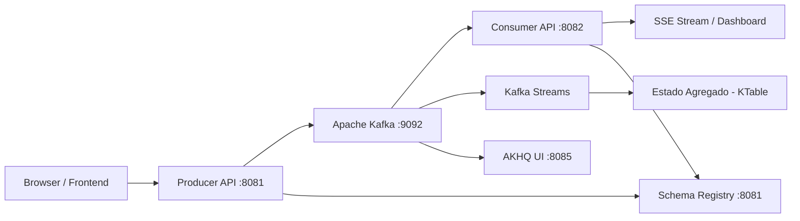
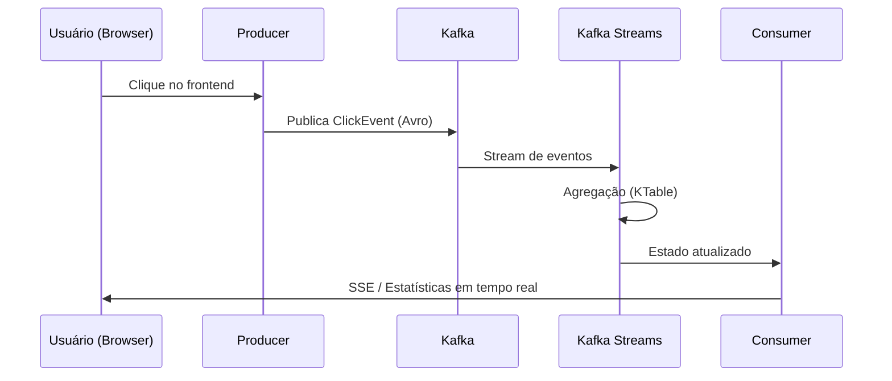
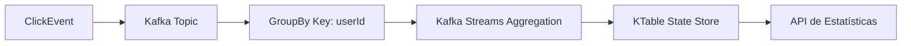

# Click Tracker com Apache Kafka e Avro

Sistema de rastreamento de cliques em tempo real utilizando **Apache Kafka**, **Avro**, **Schema Registry** e **Spring Boot**.

## Visão Geral

O Click Tracker é uma aplicação distribuída para processamento de eventos de clique em tempo real, contemplando:

- Captura de eventos via frontend
- Publicação assíncrona em Kafka
- Serialização com Avro + Schema Registry
- Processamento com Kafka Streams
- Agregações em tempo real com KTable
- Atualização de dashboard via SSE

---

## Arquitetura



---

## Fluxo de Eventos



---

## Fluxo de Agregação



---

## Tecnologias

| Tecnologia      | Finalidade               |
| --------------- | ------------------------ |
| Java 17         | Linguagem                |
| Spring Boot     | Backend principal        |
| Apache Kafka    | Streaming de eventos     |
| Avro            | Serialização de dados    |
| Schema Registry | Governança de schemas    |
| Kafka Streams   | Processamento de eventos |
| Docker Compose  | Infraestrutura           |
| AKHQ            | Interface Kafka          |

---

## Estrutura do Projeto

```
click-tracker/
├── docker-compose.yml
├── avro-schemas/
│   └── ClickEvent.avsc
├── click-producer/
│   ├── controller/
│   ├── service/
│   └── config/
├── click-consumer/
│   ├── controller/
│   ├── service/
│   └── config/
└── README.md
```

---

## Pré-requisitos

* Java 17+
* Maven 3.6+
* Docker Desktop
* 8 GB RAM recomendado

---

## Como Executar

### 1. Subir infraestrutura

```bash
docker-compose up -d
```

### 2. Gerar classes Avro

```bash
cd click-producer && mvn clean generate-sources
cd ../click-consumer && mvn clean generate-sources
```

### 3. Executar Producer

```bash
cd click-producer
mvn spring-boot:run
```

### 4. Executar Consumer

```bash
cd click-consumer
mvn spring-boot:run
```

---

## Endpoints

### Producer (:8081)

| Método | Endpoint      | Descrição                |
| ------ | ------------- | ------------------------ |
| GET    | `/`           | Interface de testes      |
| POST   | `/api/clicks` | Publica evento de clique |

Exemplo:

```json
{
  "userId": "user123",
  "page": "/home",
  "elementId": "button1",
  "sessionId": "session_abc"
}
```

---

### Consumer (:8082)

| Método | Endpoint            | Descrição              |
| ------ | ------------------- | ---------------------- |
| GET    | `/api/stats`        | Estatísticas agregadas |
| GET    | `/api/stats/stream` | Stream SSE             |

Exemplo de resposta:

```json
{
  "totalClicks": 156,
  "userClickCount": {
    "user123": 45
  },
  "pageClickCount": {
    "/home": 89
  },
  "elementClickCount": {
    "button1": 34
  }
}
```

---

## Conceitos Abordados

### Particionamento

* Chave: `userId`
* Garantia de ordenação por usuário
* Processamento consistente por partição

### Avro vs JSON

| Avro              | JSON          |
| ----------------- | ------------- |
| Menor payload     | Maior payload |
| Schema versionado | Sem schema    |
| Mais performático | Mais flexível |

### Schema Registry

* Controle de versão de schemas
* Validação de compatibilidade
* Evolução segura de eventos

### Kafka Streams

* Processamento stateful
* Agregações via KTable
* Materialização de estado

---

## Comandos Úteis

### Docker

```bash
docker-compose up -d
docker-compose logs -f kafka
docker ps
```

### Kafka

```bash
kafka-topics --list --bootstrap-server localhost:9092
```

---

## Troubleshooting

### Schema Registry indisponível

```bash
curl http://localhost:8081
```

### Portas em uso

* AKHQ: 8085

### Problemas com Avro

* Converter CharSequence:

```java
value.toString();
```

---

## Considerações

O sistema implementa uma arquitetura orientada a eventos com foco em escalabilidade, rastreabilidade e processamento em tempo real.

---
 
